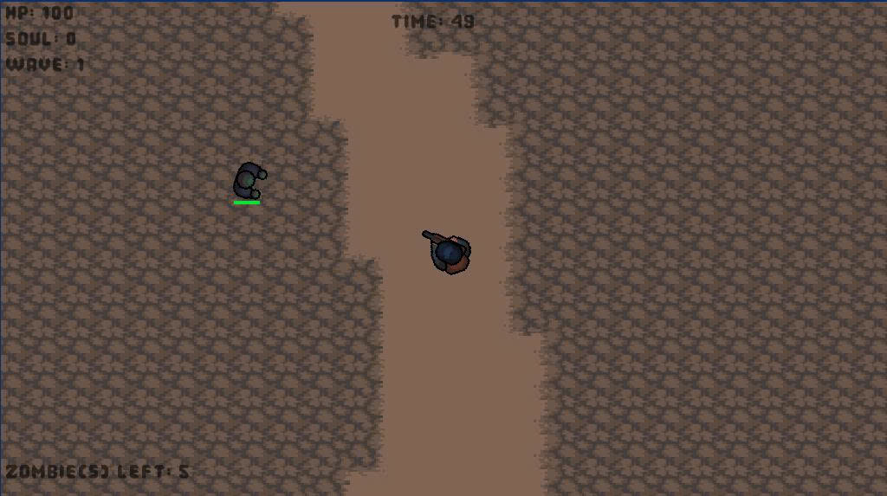
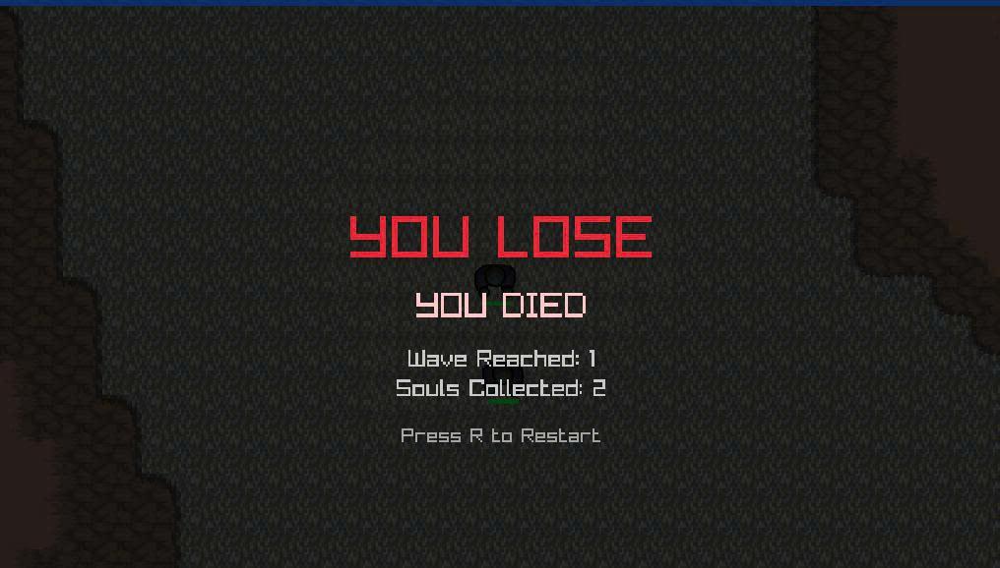

# Zombie Shooter

A high-performance, top-down zombie survival shooter built in C++ with raylib for rendering and CMake for build automation.

## Screenshot




## Prerequisites

To build and run the game, you will need the following installed on your system:
* A modern C++ compiler supporting **C++17** or later.
* **CMake** (v3.15 or higher).

## Build Instruction

```bash
# Configure
cmake -B build

# Build
cmake --build build
```

## Running

```bash
.\build\Debug\Zombie_Shooter.exe
```
